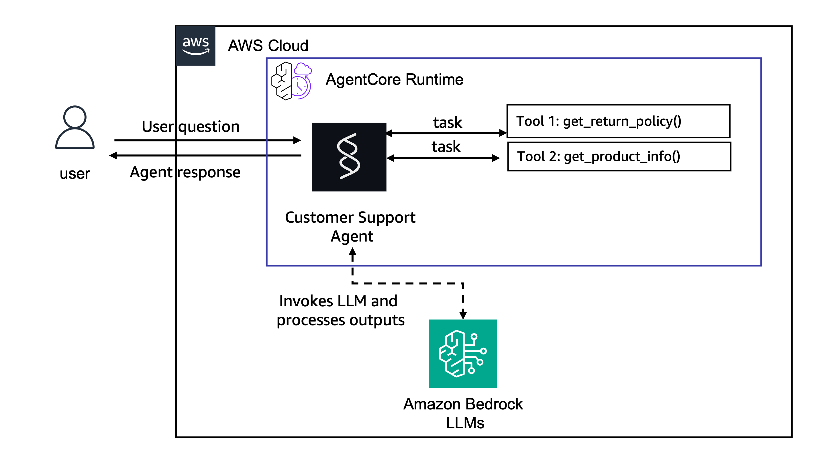

# Getting Started with Amazon Bedrock AgentCore

Build, test, and deploy an AI agent to AgentCore in under 10 minutes.


Amazon Bedrock AgentCore supports various interfaces for developing and deploying your agent code. At the lowest level, you can interact with the AgentCore APIs directly or through the [AWS SDKs](https://docs.aws.amazon.com/sdkref/latest/guide/overview.html) (such as [boto3](https://docs.aws.amazon.com/boto3/latest/reference/services/bedrock-agentcore.html)). For a simpler development experience, the [AgentCore Python SDK](https://github.com/aws/bedrock-agentcore-sdk-python) and [AgentCore Typescript SDK](https://github.com/aws/bedrock-agentcore-sdk-typescript) provide higher-level abstractions for integrating with AgentCore services like runtime, memory, and tools. The [AgentCore CLI](https://github.com/aws/agentcore-cli) builds on top of these, offering the best developer experience that lets you quickly scaffold, configure, and deploy agents. The AgentCore CLI is the easiest way to get started, and continues to be the best developer experience as you iterate on your agents. 

In this sample, we use the AgentCore CLI to walk through one simple example — a customer support agent with custom tools — but AgentCore supports much more: persistent memory, centralized tool management via MCP Gateway, identity and auth, observability, evaluations, and multi-framework support (Strands, LangGraph, CrewAI, OpenAI Agents SDK, Google ADK, and others).

## What You'll Build

A customer support agent that can:

- Look up product information and specifications
- Answer questions about return policies
- Combine tool results with LLM reasoning to provide helpful responses

By the end, your agent will be running both locally (for development) and in the cloud (for production).

## Architecture



## Prerequisites

| Requirement | Minimum Version | Install |
|---|---|---|
| Node.js | 20.x | [nodejs.org](https://nodejs.org/) |
| uv | 0.4+ | `curl -LsSf https://astral.sh/uv/install.sh \| sh` |
| AWS CLI | 2.x | [AWS CLI install guide](https://docs.aws.amazon.com/cli/latest/userguide/getting-started-install.html) |
| Git | 2.x | [git-scm.com](https://git-scm.com/) |

### Install the AgentCore CLI

```bash
npm install -g @aws/agentcore
agentcore --version
```

### Configure AWS credentials

You need an AWS account with Amazon Bedrock model access enabled (this sample uses Claude Sonnet via Bedrock).

```bash
aws configure
# Or set environment variables:
# export AWS_ACCESS_KEY_ID=<your-key>
# export AWS_SECRET_ACCESS_KEY=<your-secret>
# export AWS_DEFAULT_REGION=us-east-1
```

Verify your credentials:

```bash
aws sts get-caller-identity
```

### Required IAM permissions

Your IAM user/role needs permissions for CloudFormation, S3, IAM role management, Lambda, CloudWatch Logs, and Bedrock AgentCore. 

---

## Step 1: Create the Project (~1 min)

Scaffold a new AgentCore project using the CLI:

```bash
agentcore create \
  --name CustomerSupport \
  --framework Strands \
  --model-provider Bedrock \
  --defaults
```

You should see:

```
[done]  Create CustomerSupport/ project directory
[done]  Prepare agentcore/ directory
[done]  Initialize git repository
[done]  Add agent to project
[done]  Set up Python environment

Created:
  CustomerSupport/
    app/CustomerSupport/  Python agent (Strands)
    agentcore/            Config and CDK project

Project created successfully!
```

Navigate into the project:

```bash
cd CustomerSupport
```

### What was generated?

```
CustomerSupport/
├── agentcore/
│   ├── agentcore.json          # Project configuration (agents, memories, etc.)
│   ├── aws-targets.json        # Deployment targets (region, account)
│   ├── .env.local              # API keys (gitignored)
│   └── cdk/                    # CDK infrastructure (auto-managed)
└── app/
    └── CustomerSupport/
        ├── main.py             # Agent entry point
        ├── model/load.py       # Model configuration (Claude on Bedrock)
        ├── mcp_client/         # MCP client for external tool servers
        └── pyproject.toml      # Python dependencies
```

Key files:
- **`app/CustomerSupport/main.py`** — Your agent code. This is where you define tools and the system prompt.
- **`app/CustomerSupport/model/load.py`** — Model configuration. Defaults to Claude Sonnet via Amazon Bedrock.
- **`agentcore/agentcore.json`** — Project config that defines agents, memories, and other AgentCore resources.

---

## Step 2: Add Custom Tools (~3 min)

The generated project comes with a sample `add_numbers` tool. Let's replace it with customer support tools.

Open `app/CustomerSupport/main.py` and replace the entire contents with:

```python
from strands import Agent, tool
from bedrock_agentcore.runtime import BedrockAgentCoreApp
from model.load import load_model

app = BedrockAgentCoreApp()
log = app.logger

# --- Product & Policy Data ---

RETURN_POLICIES = {
    "electronics": {
        "window": "30 days",
        "condition": "Original packaging required, must be unused or defective",
        "refund": "Full refund to original payment method",
    },
    "accessories": {
        "window": "14 days",
        "condition": "Must be in original packaging, unused",
        "refund": "Store credit or exchange",
    },
    "audio": {
        "window": "30 days",
        "condition": "Defective items only after 15 days",
        "refund": "Full refund within 15 days, replacement after",
    },
}

PRODUCTS = {
    "PROD-001": {"name": "Wireless Headphones", "price": 79.99, "category": "audio",
                 "description": "Noise-cancelling Bluetooth headphones with 30h battery life", "warranty_months": 12},
    "PROD-002": {"name": "Smart Watch", "price": 249.99, "category": "electronics",
                 "description": "Fitness tracker with heart rate monitor, GPS, and 5-day battery", "warranty_months": 24},
    "PROD-003": {"name": "Laptop Stand", "price": 39.99, "category": "accessories",
                 "description": "Adjustable aluminum laptop stand for ergonomic desk setup", "warranty_months": 6},
    "PROD-004": {"name": "USB-C Hub", "price": 54.99, "category": "accessories",
                 "description": "7-in-1 USB-C hub with HDMI, USB-A, SD card reader, and ethernet", "warranty_months": 12},
    "PROD-005": {"name": "Mechanical Keyboard", "price": 129.99, "category": "electronics",
                 "description": "RGB mechanical keyboard with Cherry MX switches", "warranty_months": 24},
}


# --- Tools ---

@tool
def get_return_policy(product_category: str) -> str:
    """Get return policy information for a specific product category.

    Args:
        product_category: Product category (e.g., 'electronics', 'accessories', 'audio')

    Returns:
        Formatted return policy details including timeframes and conditions
    """
    category = product_category.lower()
    if category in RETURN_POLICIES:
        policy = RETURN_POLICIES[category]
        return (f"Return policy for {category}: Window: {policy['window']}, "
                f"Condition: {policy['condition']}, Refund: {policy['refund']}")
    return f"No specific return policy found for '{product_category}'. Please contact support."


@tool
def get_product_info(query: str) -> str:
    """Search for product information by name, ID, or keyword.

    Args:
        query: Product name, ID (e.g., 'PROD-001'), or search keyword

    Returns:
        Product details including name, price, category, and description
    """
    query_lower = query.lower()
    # Search by product ID
    if query.upper() in PRODUCTS:
        p = PRODUCTS[query.upper()]
        return (f"{p['name']} ({query.upper()}): ${p['price']}, Category: {p['category']}, "
                f"{p['description']}, Warranty: {p['warranty_months']} months")
    # Search by keyword
    results = [
        f"{pid}: {p['name']} - ${p['price']} - {p['description']}"
        for pid, p in PRODUCTS.items()
        if query_lower in p['name'].lower() or query_lower in p['description'].lower()
           or query_lower in p['category'].lower()
    ]
    if results:
        return "Found products:\n" + "\n".join(results)
    return f"No products found matching '{query}'."


# --- Agent Setup ---

SYSTEM_PROMPT = """You are a helpful and professional customer support assistant for an e-commerce company.

Your role is to:
- Provide accurate information using the tools available to you
- Be friendly, patient, and understanding with customers
- Always offer additional help after answering questions

You have access to:
1. get_return_policy() - Look up return policies by product category
2. get_product_info() - Search product information by name, ID, or keyword

Always use the appropriate tool rather than guessing."""

_agent = None

def get_or_create_agent():
    global _agent
    if _agent is None:
        _agent = Agent(
            model=load_model(),
            system_prompt=SYSTEM_PROMPT,
            tools=[get_return_policy, get_product_info],
        )
    return _agent


@app.entrypoint
async def invoke(payload, context):
    log.info("Invoking Agent...")
    agent = get_or_create_agent()
    stream = agent.stream_async(payload.get("prompt"))
    async for event in stream:
        if "data" in event and isinstance(event["data"], str):
            yield event["data"]


if __name__ == "__main__":
    app.run()
```

### What's happening here?

This code creates a customer support agent with two local tools (`get_return_policy` and `get_product_info`) using the [Strands Agents SDK](https://strandsagents.com/). The `BedrockAgentCoreApp` from the AgentCore SDK wraps the agent with the runtime entrypoint (`@app.entrypoint`), making it deployable to AgentCore Runtime — both locally via `agentcore dev` and in the cloud via `agentcore deploy`. The `@tool` decorator turns plain Python functions into tools the LLM can call, using the docstring as the tool description the model reads to decide when and how to invoke each tool.

---

## Step 3: Test Locally (~2 min)

Start the local development server:

```bash
agentcore dev
```

This starts an interactive chat interface in your terminal. The CLI automatically:
1. Creates a Python virtual environment (`.venv`) if needed
2. Installs dependencies via `uv sync`
3. Starts a local server on port 8080 with hot reload

### Try these queries

**Product lookup:**
```
Tell me about the Wireless Headphones
```
→ The agent calls `get_product_info("headphones")` and returns product details.

**Return policy:**
```
What's the return policy for electronics?
```
→ The agent calls `get_return_policy("electronics")` and explains the 30-day window.

**Multi-tool query:**
```
I bought a Smart Watch (PROD-002) and want to return it. What's the policy?
```
→ The agent calls both `get_product_info("PROD-002")` to identify the category, then `get_return_policy("electronics")` for the policy.

Press `Esc` to exit the dev server.

### CLI invocation (non-interactive)

You can also invoke the agent from the command line. In one terminal:

```bash
agentcore dev --logs
```

In another terminal:

```bash
agentcore dev "What products do you have?" --stream
```

---

## Step 4: Deploy to AWS (~4 min)

Deploy your agent to AgentCore Runtime with a single command:

```bash
agentcore deploy
```

The CLI handles everything:
- Packages your code and dependencies
- Provisions IAM roles and the runtime environment via CDK
- Deploys to a fully managed, serverless endpoint

Check the deployment status:

```bash
agentcore status
```

You should see:

```
AgentCore Status (target: default, us-east-1)

Agents
  CustomerSupport: Deployed - Runtime: READY (arn:aws:bedrock-agentcore:...)
```

### Invoke the deployed agent

```bash
agentcore invoke "What's the return policy for audio products?" --stream
```

The response streams directly from your cloud-deployed agent.

Try a few more:

```bash
agentcore invoke "Tell me about product PROD-004" --stream
agentcore invoke "What can you help me with?" --stream
```

---

## What's Next?

You now have a working agent running locally and in the cloud. Here are the next steps to make it production-ready:

| Feature | CLI Command | What It Does |
|---|---|---|
| **Add Memory** | `agentcore add memory --name SharedMemory --strategies SEMANTIC,SUMMARIZATION --expiry 30` | Agent remembers users across sessions |
| **Add Gateway** | `agentcore add gateway --name my-gateway --runtimes CustomerSupport` | Centralize and share tools across agents via MCP |
| **Add Evaluations** | `agentcore add online-eval --name QualityMonitor --agent CustomerSupport --evaluator Builtin.GoalSuccessRate --sampling-rate 100 --enable-on-create` | Continuous quality monitoring |
| **View Logs** | `agentcore logs` | Stream live logs from your deployed agent |
| **View Traces** | `agentcore traces list --limit 10` | Inspect OpenTelemetry traces in CloudWatch |

For a full walkthrough of all these features, see the [AgentCore CLI Workshop](https://catalog.us-east-1.prod.workshops.aws/workshops/c770f35f-90a9-4e02-8985-4ef912bddb77).

### Useful resources

- [AgentCore CLI documentation](https://github.com/aws/agentcore-cli)
- [Amazon Bedrock AgentCore documentation](https://docs.aws.amazon.com/bedrock-agentcore/)
- [Strands Agents SDK](https://strandsagents.com/)

---

## Clean Up

To tear down all deployed resources:

```bash
agentcore remove all
agentcore deploy
```

This deletes the AgentCore Runtime and all associated AWS resources (IAM roles, S3 artifacts, CloudFormation stack).
