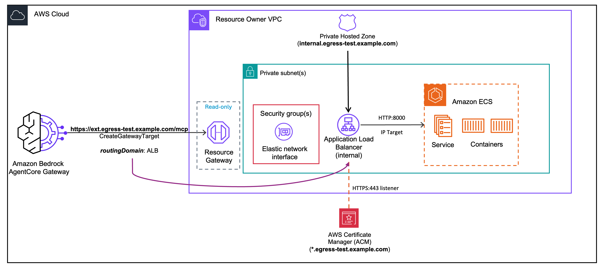

<!-- Copyright Amazon.com, Inc. or its affiliates. All Rights Reserved. -->
<!-- SPDX-License-Identifier: Apache-2.0 -->

# ECS Deployment

> This feature is made available to you as a "Beta Service" as defined in the [AWS Service Terms](https://aws.amazon.com/service-terms/). It is subject to your Agreement with AWS and the AWS Service Terms.


Deploy MCP servers on Amazon ECS and connect them to AgentCore Gateway using VPC egress.

## Architecture



An internal Application Load Balancer (ALB) sits in front of the ECS services. A Route 53 private hosted zone maps a private domain to the ALB. The `routingDomain` parameter tells VPC Lattice to route via the ALB's publicly resolvable DNS.

- **Private domain**: only resolves inside the VPC (e.g., `ecs-mcp.example.com`)
- **TLS termination**: ALB terminates HTTPS with an ACM public certificate, forwards plain HTTP to ECS tasks
- **No public DNS needed**: no CNAME record or domain ownership required

```
AgentCore Gateway → VPC Lattice (routingDomain: ALB *.elb.amazonaws.com)
    → Resource Gateway ENIs → Internal ALB (HTTPS :443, public cert) → ECS Fargate Tasks (HTTP :8000)
```

## Prerequisites

- Completed [Lab 0: Prerequisites](../00-prerequisites/) (VPC + AgentCore Gateway deployed)
- Docker running (for CDK container image builds)
- An ACM public certificate: see [Create an ACM Public Certificate](../00-prerequisites/create-acm-public-certificate.md)

## Labs

| Notebook | Description |
|----------|-------------|
| [fargate-mcp-gateway-managed.ipynb](./fargate-mcp-gateway-managed.ipynb) | Deploy a FastMCP server on ECS Fargate behind an internal ALB with private DNS and `routingDomain`, then connect to AgentCore Gateway using managed VPC Lattice. |

## License

This project is licensed under the Apache License 2.0. See the [LICENSE](../LICENSE.txt) file for details.
