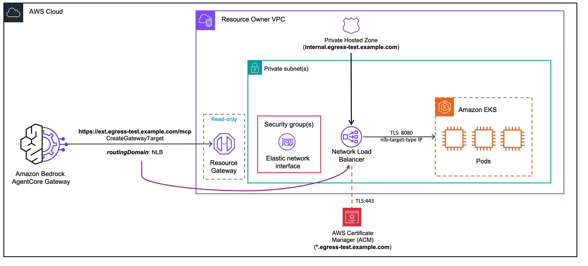

<!-- Copyright Amazon.com, Inc. or its affiliates. All Rights Reserved. -->
<!-- SPDX-License-Identifier: Apache-2.0 -->

# EKS Deployment

> This feature is made available to you as a "Beta Service" as defined in the [AWS Service Terms](https://aws.amazon.com/service-terms/). It is subject to your Agreement with AWS and the AWS Service Terms.

Deploy MCP servers and REST APIs on Amazon EKS and connect them to AgentCore Gateway using VPC egress.

## Scope

The labs in this section use a **private hosted zone** with a **public certificate** and `routingDomain`. The endpoint domain only resolves inside the VPC, while VPC Lattice routes traffic via the NLB's publicly resolvable DNS. For other domain and certificate combinations, see [Advanced Concepts](../03-advanced-concepts/).

## Architecture



An [NGINX Ingress Controller](https://kubernetes.github.io/ingress-nginx/) runs behind a single internal Network Load Balancer (NLB). The NLB provides:

- **Static IPs**: one per AZ, useful for allowlisting
- **TLS termination**: terminates TLS with an ACM public certificate and forwards plain HTTP to NGINX

NGINX performs **path-based routing** to multiple backend services, so a single NLB can serve multiple MCP servers (e.g., `/mcp-server/mcp` and `/stock-mcp/mcp`).

```bash
AgentCore Gateway
  → VPC Lattice (routingDomain: NLB *.elb.amazonaws.com)
    → Resource Gateway ENIs
      → Internal NLB (TLS :443, public cert)
        → NGINX Ingress (HTTP :80, path-based routing)
          → EKS Pods (HTTP :8000 or :8080)
```

## Prerequisites

- Completed [Lab 0: Prerequisites](../00-prerequisites/) (VPC + AgentCore Gateway deployed)
- An ACM public certificate: see [Create an ACM Public Certificate](../00-prerequisites/create-acm-public-certificate.md)
- A parent domain for the private hosted zone: see [Public Certificate + Private Domain](../00-prerequisites/public-certificate-private-domain.md)

> **Cost Warning:** Running an EKS cluster incurs ongoing charges ($0.10/hr for the control plane + EC2 node group instances). An internal NLB adds additional cost. Make sure to run the **Cleanup** section in each notebook after completing the lab, and destroy the `SharedEksCluster` stack when you're done with all EKS labs to avoid unnecessary charges. See [Amazon EKS pricing](https://aws.amazon.com/eks/pricing/) and [Elastic Load Balancing pricing](https://aws.amazon.com/elasticloadbalancing/pricing/) for details.

## Labs

| Notebook | Description |
|----------|-------------|
| [mcp-server-gateway-managed.ipynb](./mcp-server-gateway-managed.ipynb) | Deploy FastMCP servers on EKS behind an NGINX Ingress Controller (single NLB, path-based routing), with a private hosted zone and `routingDomain`. Uses managed VPC Lattice. |
| [api-server-gateway-managed.ipynb](./api-server-gateway-managed.ipynb) | Deploy a REST API (FastAPI) on EKS behind an internal NLB, connected to AgentCore Gateway with an OpenAPI schema. Uses private hosted zone and `routingDomain`. |

## License

This project is licensed under the Apache License 2.0. See the [LICENSE](../LICENSE.txt) file for details.
