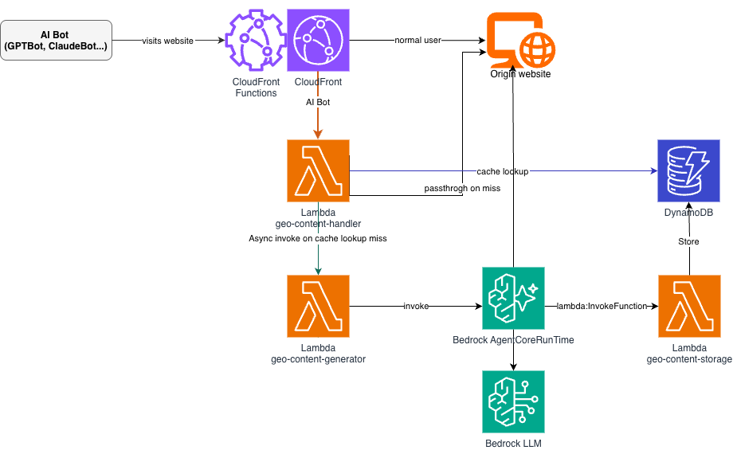

# GEO Agent

Generative Engine Optimization (GEO) agent deployed via [Amazon Bedrock AgentCore](https://docs.aws.amazon.com/bedrock/latest/userguide/agentcore.html), with Amazon CloudFront OAC + AWS Lambda Function URL for edge serving. AI search engine crawlers receive GEO-optimized content automatically.

## Architecture & Overview



1. Amazon CloudFront Function detects AI bot User-Agents and routes them to an AWS Lambda Function URL (OAC + SigV4)
2. The Lambda handler checks Amazon DynamoDB for cached GEO content
3. On cache miss, it triggers async generation via Amazon Bedrock AgentCore — the agent fetches the original page, rewrites it for GEO, and stores the result
4. Normal users bypass this path entirely — zero impact on standard web performance

The agent has four tools:

| Tool | Description |
|------|-------------|
| `rewrite_content_for_geo` | Rewrites content into GEO-optimized format |
| `evaluate_geo_score` | Three-perspective GEO readiness scoring |
| `generate_llms_txt` | Generates AI-friendly `llms.txt` for websites |
| `store_geo_content` | Fetch → Rewrite → Score → Store to Amazon DynamoDB |

Multi-tenancy is built in: multiple Amazon CloudFront distributions share a single Lambda + Amazon DynamoDB set, isolated via `{host}#{path}` composite keys. The agent writes to Amazon DynamoDB through a dedicated storage Lambda (decoupled — agent only needs `lambda:InvokeFunction`).

## Prerequisites

| Tool | Version | Installation |
|------|---------|-------------|
| Python | >= 3.10 | macOS: `brew install python@3.10` / Windows: [python.org](https://www.python.org/downloads/) |
| Node.js | >= 20 | macOS: `brew install node@20` / Windows: [nodejs.org](https://nodejs.org/) / Any: `nvm install 20` |
| AWS CLI | v2 | macOS: `brew install awscli` / Windows: [AWS CLI MSI installer](https://awscli.amazonaws.com/AWSCLIV2.msi) |
| AWS SAM CLI | latest | macOS: `brew install aws-sam-cli` / Windows: [SAM CLI MSI installer](https://github.com/aws/aws-sam-cli/releases/latest) |

You also need an AWS account with credentials configured (`aws configure`) and appropriate IAM permissions (see [Deployment Reference](docs/deployment.md)).

## Deployment Steps

### Option A: Interactive Setup (recommended)

**macOS / Linux / Windows (WSL or Git Bash):**

```bash
source ./setup.sh
```

The script handles everything: dependency installation, Amazon Bedrock AgentCore deployment, SAM configuration, and infrastructure deployment. It will prompt for AWS Region, origin domain, account ID, and Amazon CloudFront distribution settings.

> **Windows without WSL:** Follow Option B below.

### Option B: Manual Step-by-Step

#### 1. Set up the Python environment

**macOS / Linux:**

```bash
python3 -m venv .venv
source .venv/bin/activate
pip install -e .
```

**Windows (PowerShell):**

```powershell
python -m venv .venv
.\.venv\Scripts\Activate.ps1
pip install -e .
```

If you see a `RequestsDependencyWarning` about `chardet`, run `pip uninstall chardet -y`.

#### 2. Deploy the Amazon Bedrock AgentCore agent

```bash
agentcore configure   # Entrypoint: src/main.py, Region: us-east-1
agentcore deploy
```

#### 3. Deploy edge serving infrastructure

**macOS / Linux:**

```bash
cp samconfig.toml.example samconfig.toml
```

**Windows:**

```powershell
Copy-Item samconfig.toml.example samconfig.toml
```

Edit `samconfig.toml` with your values, then:

```bash
sam build -t infra/template.yaml
sam deploy -t infra/template.yaml
```

Or pass overrides directly:

```bash
sam deploy -t infra/template.yaml \
  --stack-name geo-backend --region us-east-1 --resolve-s3 \
  --capabilities CAPABILITY_IAM \
  --parameter-overrides \
    AgentRuntimeArn=<AGENT_ARN> \
    DefaultOriginHost=www.example.com \
    CreateDistribution=true
```

See [Deployment Reference](docs/deployment.md) for SAM parameters, multi-site deployment, and Amazon CloudFront Function updates.

## Sample Queries / Usage Examples

### Local development

```bash
agentcore dev
agentcore invoke --dev "Rewrite this article for GEO: https://example.com/article/123"
agentcore invoke --dev "Evaluate GEO score for https://example.com/article/123"
agentcore invoke --dev "Generate llms.txt for example.com"
agentcore invoke --dev "Store GEO content for https://example.com/article/123"
```

### Production

```bash
agentcore invoke "Evaluate GEO score for https://example.com/article/123"
agentcore invoke "Store GEO content for https://example.com/article/123"
```

### Testing edge serving via Amazon CloudFront

```bash
curl "https://<CF_DOMAIN>/article/123?ua=genaibot"              # passthrough (default)
curl "https://<CF_DOMAIN>/article/123?ua=genaibot&mode=sync"    # wait for generation
curl "https://<CF_DOMAIN>/article/123?ua=genaibot&mode=async"   # 202 + background generation
curl "https://<FUNCTION_URL>/article/123"                        # should return 403
curl "https://<CF_DOMAIN>/llms.txt?ua=genaibot"                 # llms.txt
```

Scores dashboard: `https://<CF_DOMAIN>/?ua=genaibot&action=scores`

### Querying score data

```bash
python scripts/query_scores.py --stats
python scripts/query_scores.py --top 10
python scripts/query_scores.py --url /article/123
python scripts/query_scores.py --export scores.json
```

### Environment variables

| Variable | Default | Description |
|----------|---------|-------------|
| `MODEL_ID` | `us.anthropic.claude-sonnet-4-20250514-v1:0` | Amazon Bedrock model ID |
| `AWS_REGION` | `us-east-1` | AWS region |
| `GEO_TABLE_NAME` | `geo-content` | Amazon DynamoDB table name |
| `BEDROCK_GUARDRAIL_ID` | _(empty)_ | Amazon Bedrock Guardrail ID (optional) |
| `BEDROCK_GUARDRAIL_VERSION` | `DRAFT` | Guardrail version |

## Cleanup Instructions

### Remove infrastructure

```bash
sam delete --stack-name geo-backend --region us-east-1
```

This deletes all SAM-managed resources (AWS Lambda functions, Amazon DynamoDB table, OAC, Amazon CloudFront distribution if created by the stack).

### Remove the agent

```bash
agentcore destroy
```

### Remove the Amazon CloudFront Function (if deployed separately)

```bash
ETAG=$(aws cloudfront describe-function --name geo-bot-router-oac --query 'ETag' --output text)
aws cloudfront delete-function --name geo-bot-router-oac --if-match "$ETAG"
```

### Clean up local environment

**macOS / Linux:**

```bash
deactivate
rm -rf .venv
rm samconfig.toml
```

**Windows (PowerShell):**

```powershell
deactivate
Remove-Item -Recurse -Force .venv
Remove-Item samconfig.toml
```
