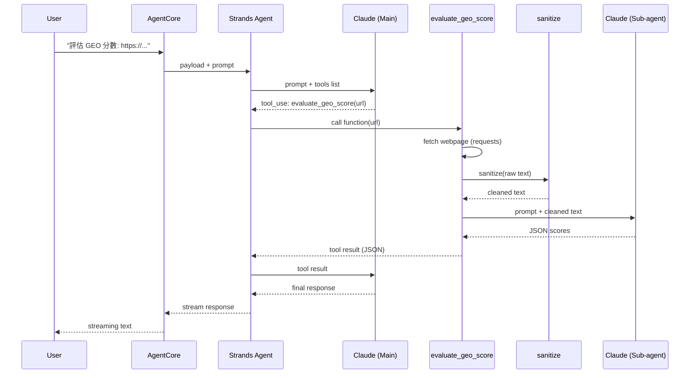

This is a project generated by the agentcore create --template basic CLI tool!

# Layout

There are two directories generated, `src/` and `test/`. At the root, there is a `.gitignore` file, a `.bedrock_agentcore.yaml` file
which is used for other `agentcore` commands like `deploy`, `dev`, and `invoke`.

## src/

The main entrypoint to your app is defined in `src/main.py`. Using the AgentCore SDK `@app.entrypoint` decorator, this file defines a Starlette ASGI app with the chosen Agent framework SDK
running within.

`src/mcp_client/client.py` implements an MCP client using the library from your chosen Agent framework SDK.

`src/model/load.py` instantiates your chosen model provider.

## test/

Tests are not defined by default. Add your own pytest definitions here.

# Developing locally

## Setup

```bash
./setup.sh
source .venv/bin/activate
```

This installs all dependencies including the `agentcore` CLI (provided by `bedrock-agentcore-starter-toolkit`) and fixes known dependency conflicts.

> **Note:** The CLI package name on PyPI is `bedrock-agentcore-starter-toolkit`, NOT `agentcore` (that's an unrelated package).

## Configure AWS

```bash
agentcore configure
```

This will interactively set up your AWS region, IAM role, S3 bucket, and agent settings in `.bedrock_agentcore.yaml`.

## Troubleshooting

### `RequestsDependencyWarning: urllib3 ... or chardet ... doesn't match a supported version`

This is caused by `chardet` and `charset_normalizer` both being installed. `prance` (a transitive dependency of `bedrock-agentcore-starter-toolkit`) pulls in `chardet`, which conflicts with `requests`' preferred `charset_normalizer`.

Fix:

```bash
pip uninstall chardet -y
```

`agentcore dev` may reinstall dependencies and bring `chardet` back. Re-run the fix if the warning reappears.

## Run locally

```bash
agentcore dev
```

This starts a local server on 0.0.0.0:8080. In a new terminal, invoke it with:

```bash
agentcore invoke --dev "What can you do"
```

# Deployment

If you want to customize your project, you can first run `agentcore configure` before deploying. Otherwise, the default project settings
will work out of the box.

After providing credentials, `agentcore deploy` will deploy your project into Amazon Bedrock AgentCore.

Use `agentcore invoke` to invoke your deployed agent.

# FAQ

## 為什麼用 Agent，而不是直接寫 Python script 呼叫 Claude？

如果需求是固定的單一任務（例如批次評估一堆 URL 的 GEO 分數），直接寫 script 呼叫 Bedrock API 更快更簡單，只需要一次 Claude 呼叫。

用 Agent framework 的價值在於：

- **意圖判斷**：同一個入口可能要改寫內容、評估分數、或產生 llms.txt，由模型根據使用者的自然語言來決定呼叫哪個 tool
- **多步驟任務**：使用者可以說「先評估這個 URL，然後幫我改寫它的內容」，agent 能串接多個 tool 完成
- **對話式互動**：使用者可以追問、補充要求，agent 維持上下文

代價是多一次 Claude 呼叫來做意圖判斷。如果你的場景不需要這些彈性，直接用 script 是更好的選擇。

## Tool 呼叫流程

以 `evaluate_geo_score` 為例，一次完整的呼叫會經過：

1. 使用者送出 prompt → AgentCore 轉給 Strands Agent
2. Main Agent 把 prompt + tools list 送給 Claude → Claude 決定呼叫 `evaluate_geo_score`
3. Tool 執行：抓取網頁 → sanitize 過濾 → 建立 Sub-agent 請 Claude 評分
4. Tool 結果回傳給 Main Agent 的 Claude → 組織最終回應串流回使用者

整個過程有兩次 Bedrock API call（Main agent 判斷 + Sub-agent 評分），這是延遲的主要來源。



## Strands `@tool` vs MCP

這個專案的 tool 用 Strands 的 `@tool` decorator 定義，跟 agent 跑在同一個 process，呼叫就是 Python function call，沒有額外的網路開銷。

MCP (Model Context Protocol) 是標準化的 client/server 協議，tool 跑在獨立的 server 上，每次呼叫有 I/O 開銷，但好處是任何 MCP client 都能接。對這個專案來說，tool 不需要被其他 client 共用，用 `@tool` 更直接。