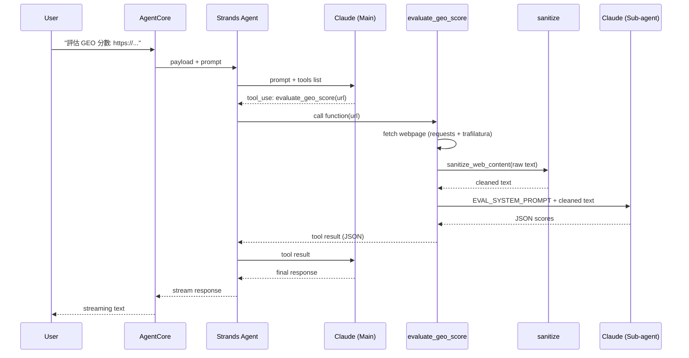
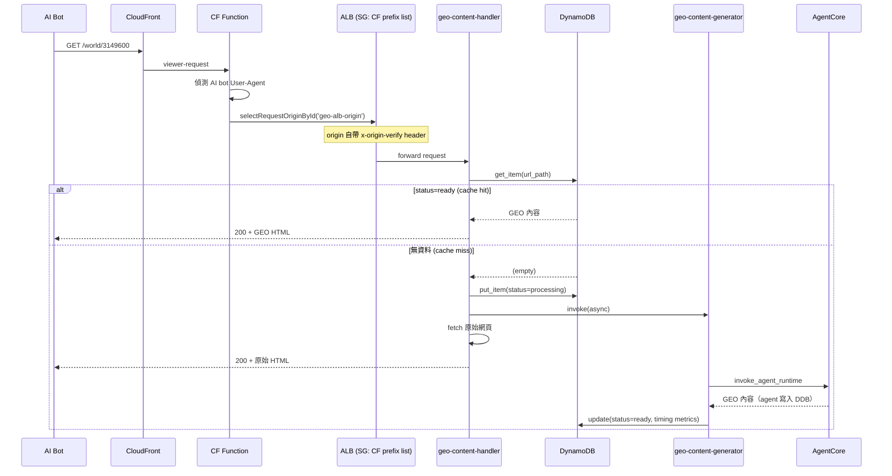
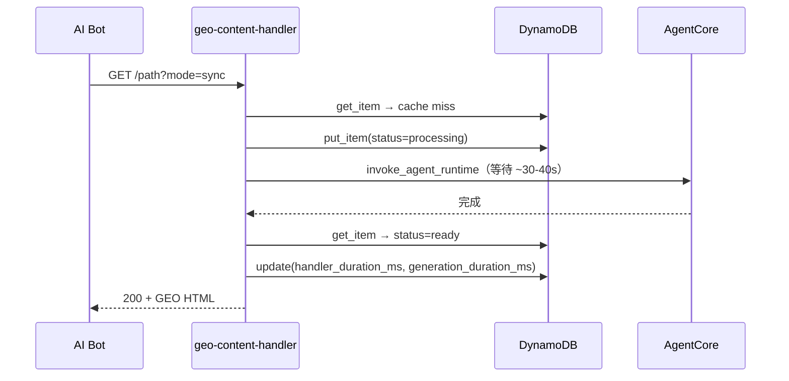

# 架構說明

## 系統總覽

```
使用者/管理員                        AI Bot (GPTBot, ClaudeBot...)
     │                                      │
     │ agentcore invoke                     │ 訪問網站
     ▼                                      ▼
┌──────────────┐                   ┌──────────────────┐
│ AgentCore    │                   │ CloudFront       │
│ GEO Agent    │                   │ (CDN)            │
│              │                   └────────┬─────────┘
│ 4 Tools:     │                            │
│ - rewrite    │                   ┌────────▼─────────┐
│ - evaluate   │                   │ CF Function      │
│ - llms.txt   │                   │ geo-bot-router   │
│ - store_geo  │                   │ 偵測 User-Agent  │
└──────┬───────┘                   │ 或 ?ua=genaibot  │
       │                           └───┬─────────┬────┘
       │ 寫入                          │         │
       ▼                          AI Bot│    一般使用者
┌──────────────┐                       │         ▼
│ DynamoDB     │                       ▼    原本 Origin
│ geo-content  │              ┌────────────┐  (不變)
└──────┬───────┘              │ ALB        │
       ▲                      │ SG: CF     │
       │                      │ prefix list│
       │                      └─────┬──────┘
       │                            │
       │                      ┌─────▼──────┐
       └──────────────────────│ Lambda     │
                  Lambda 讀取  │ handler    │
                              └────────────┘
```

## Agent Tool 呼叫流程

以 `evaluate_geo_score` 為例，一次完整的呼叫會經過兩次 Bedrock API call（Main agent 意圖判斷 + Sub-agent 執行），這是延遲的主要來源。



```
User          AgentCore      Strands Agent   Claude (Main)   evaluate_geo_score  sanitize    Claude (Sub)
 │                │                │               │                │               │              │
 │  prompt        │                │               │                │               │              │
 │───────────────>│  payload       │               │                │               │              │
 │                │───────────────>│  prompt+tools  │                │               │              │
 │                │                │──────────────>│                │               │              │
 │                │                │  tool_use     │                │               │              │
 │                │                │<──────────────│                │               │              │
 │                │                │  call(url)    │                │               │              │
 │                │                │──────────────────────────────>│               │              │
 │                │                │               │                │  fetch webpage │              │
 │                │                │               │                │──> requests   │              │
 │                │                │               │                │<── html       │              │
 │                │                │               │                │  sanitize()   │              │
 │                │                │               │                │──────────────>│              │
 │                │                │               │                │  clean text   │              │
 │                │                │               │                │<──────────────│              │
 │                │                │               │                │  prompt+text  │              │
 │                │                │               │                │─────────────────────────────>│
 │                │                │               │                │  JSON scores  │              │
 │                │                │               │                │<─────────────────────────────│
 │                │                │  tool result  │                │               │              │
 │                │                │<──────────────────────────────│               │              │
 │                │                │  tool result  │                │               │              │
 │                │                │──────────────>│                │               │              │
 │                │                │  response     │                │               │              │
 │                │                │<──────────────│                │               │              │
 │                │  stream        │               │                │               │              │
 │                │<───────────────│               │                │               │              │
 │  streaming text│                │               │                │               │              │
 │<───────────────│                │               │                │               │              │
```

## Edge Serving 流程

AI bot 訪問網站時，CloudFront Function 偵測 User-Agent 並透過 `selectRequestOriginById()` 切換到預先設定的 ALB origin。

### Passthrough 模式（預設）



### Sync 模式



## Cache Miss 模式

Lambda 支援三種 cache miss 處理模式，透過 querystring `?mode=` 切換：

| 模式 | querystring | 行為 | 適用場景 |
|------|------------|------|---------|
| passthrough（預設）| 無 或 `?mode=passthrough` | 回原始內容 + 非同步產生 | 正式環境，bot 不會空手而歸 |
| async | `?mode=async` | 回 202 + 非同步產生 | 測試用 |
| sync | `?mode=sync` | 等 AgentCore 產生完才回 | 測試用，需較長 timeout |

## DynamoDB Schema

Table: `geo-content`，partition key: `url_path` (S)

| 欄位 | 類型 | 說明 |
|------|------|------|
| `url_path` | S | URL 路徑（partition key） |
| `status` | S | `processing`（產生中）/ `ready`（可服務） |
| `geo_content` | S | GEO 優化後的 HTML 內容 |
| `content_type` | S | Content-Type，通常 `text/html; charset=utf-8` |
| `original_url` | S | 原始完整 URL |
| `mode` | S | 觸發模式：`sync` / `async` |
| `created_at` | S | 記錄建立時間（ISO 8601 UTC） |
| `updated_at` | S | 最後更新時間 |
| `generation_duration_ms` | N | AgentCore 產生 GEO 內容的純時間（ms） |
| `handler_duration_ms` | N | handler Lambda 整體處理時間（sync mode 寫入） |
| `generator_duration_ms` | N | generator Lambda 整體處理時間（async/passthrough mode 寫入） |
| `ttl` | N | DynamoDB TTL（Unix timestamp，可選） |

### 時間欄位說明

- `generation_duration_ms`：純粹 AgentCore invoke 的時間，不含 DDB 讀寫
- `handler_duration_ms`：handler Lambda 從收到 request 到回傳 response 的總時間，只在 sync mode 寫入
- `generator_duration_ms`：generator Lambda 從啟動到完成的總時間，只在 async/passthrough mode 寫入

## Response Headers

Lambda 回傳的 response 會帶以下自訂 header：

| Header | 說明 | 出現時機 |
|--------|------|---------|
| `X-GEO-Optimized: true` | 標記為 GEO 優化內容 | cache hit / sync 產生成功 |
| `X-GEO-Source` | `cache` / `generated` / `passthrough` | 所有 response |
| `X-GEO-Handler-Ms` | handler Lambda 整體處理時間（ms） | 所有 response |
| `X-GEO-Duration-Ms` | AgentCore 產生時間（ms） | cache hit / sync 產生 |
| `X-GEO-Created` | GEO 內容建立時間 | cache hit |

## Origin 保護

採用雙層保護機制：

1. 網路層：ALB Security Group 只允許 CloudFront managed prefix list（`com.amazonaws.global.cloudfront.origin-facing`）的 IP 存取，非 CloudFront 流量在網路層就被擋掉
2. 應用層（defense-in-depth）：CloudFront origin 設定自帶 `x-origin-verify` custom header，Lambda 驗證是否匹配，防止其他人的 CloudFront distribution 打你的 ALB

如果不需要 ALB，也可以直接用 Lambda Function URL + custom header 驗證（移除 ALB 相關資源即可）。

### 替代方案

- CloudFront OAC（Origin Access Control）：可在 CFF 的 `updateRequestOrigin()` 中帶 `originAccessControlConfig` 參數啟用 SigV4 簽署。Lambda Function URL 設 `AuthType: AWS_IAM`。目前未採用，留作 backlog。
- 純 ALB + custom header：移除 ALB，Lambda 只透過 ALB 存取。`x-origin-verify` 提供應用層保護。

## CloudFront Function 偵測邏輯

`geo-bot-router` 透過兩種方式偵測 AI bot：

1. User-Agent 比對：GPTBot、ClaudeBot、PerplexityBot、BingBot 等常見 AI 爬蟲
2. Querystring 模擬：`?ua=genaibot` 用於測試

偵測到後，CFF 會：
- 加上 `x-geo-bot: true`、`x-geo-bot-ua` header
- 透過 `cf.selectRequestOriginById('geo-alb-origin')` 切換到預先設定的 ALB origin
- `x-origin-verify` header 由 CloudFront origin custom header 自動帶入，CFF 不處理
