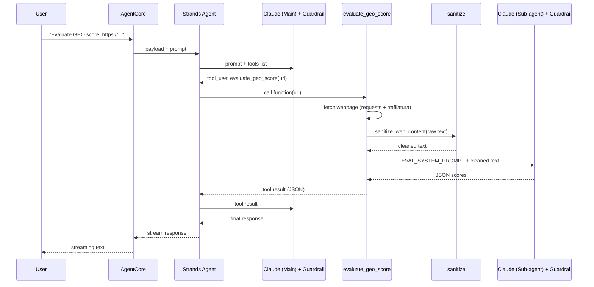
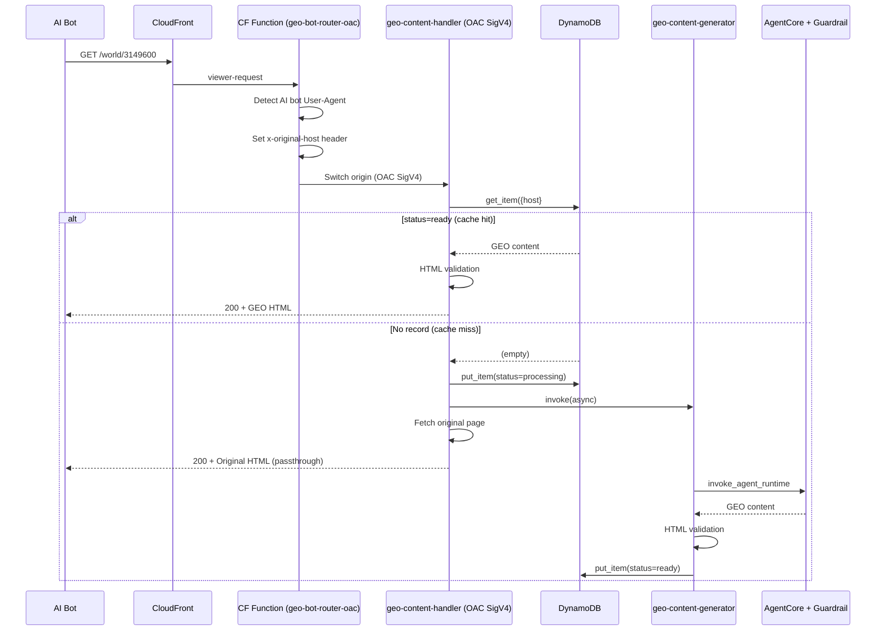
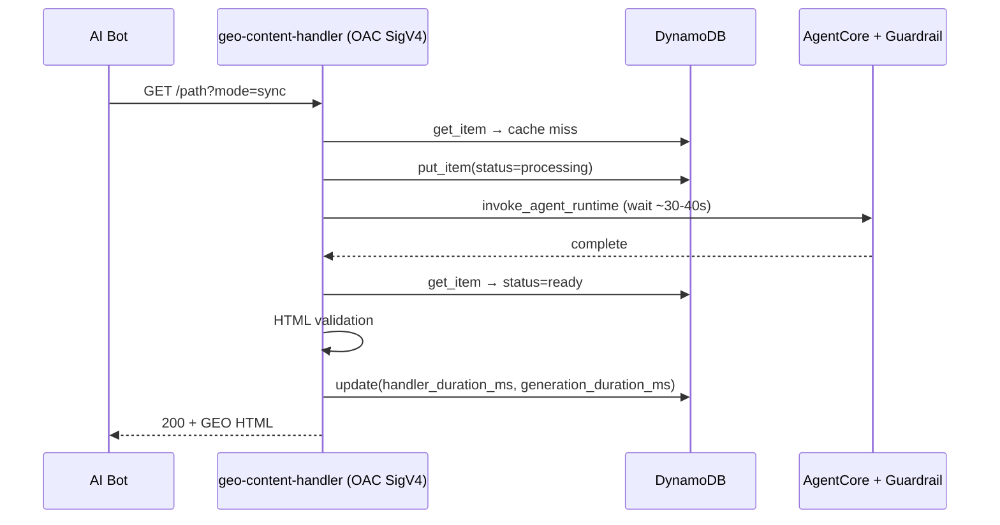

# Architecture

> [繁體中文版](architecture.zh-TW.md)

## System Overview

The system uses a CloudFront OAC + Lambda Function URL architecture.
Multiple CloudFront distributions share a single set of Lambda + DynamoDB, achieving multi-tenancy via `{host}#{path}` composite keys.


```
AI Bot (GPTBot, ClaudeBot...)
     │
     │ visits website
     ▼
┌──────────────────┐
│ CloudFront       │  ← multiple distributions share the same Lambda origin
│ (CDN)            │
└────────┬─────────┘
         │
┌────────▼─────────┐
│ CFF              │
│ geo-bot-router   │
│ -oac             │
│ detect User-Agent│
│ set x-original-  │
│ host header      │
└───┬─────────┬────┘
    │         │
AI Bot    Normal User
    │         ▼
    ▼    Original Origin (unchanged)
┌────────────┐
│ Lambda     │
│ Function   │
│ URL (OAC)  │
│ SigV4 auth │
└─────┬──────┘
      │
      ▼
┌──────────────┐     ┌─────────────────────────┐
│ DynamoDB     │     │ Bedrock AgentCore       │
│ geo-content  │ ◄── │ (GEO Agent)             │
│ {host}#path  │     │   │                     │
└──────────────┘     │   ▼                     │
                     │ Bedrock LLM             │
                     │ + Guardrail (optional)   │
                     └─────────────────────────┘
```

## Agent ↔ DynamoDB Decoupled Architecture

The Agent does not access DynamoDB directly. The `store_geo_content` tool invokes the `geo-content-storage` Lambda via `lambda:InvokeFunction`, which handles DDB writes.

```
Agent (store_geo_content)
    │
    │ lambda:InvokeFunction
    ▼
┌──────────────────┐
│ geo-content-     │
│ storage Lambda   │
│ (DDB CRUD)       │
│ + HTML validation│
└────────┬─────────┘
         │ put_item
         ▼
┌──────────────────┐
│ DynamoDB         │
│ geo-content      │
└──────────────────┘
```

Benefits:
- Agent only needs `lambda:InvokeFunction` permission, no DDB permissions required
- DDB schema changes don't affect Agent code
- Storage Lambda can be independently scaled, with added validation and logging

## Bedrock Guardrail (Optional)

The system supports Bedrock Guardrail, enabled via environment variables:

| Variable | Default | Description |
|----------|---------|-------------|
| `BEDROCK_GUARDRAIL_ID` | (empty, disabled) | Guardrail ID |
| `BEDROCK_GUARDRAIL_VERSION` | `DRAFT` | Guardrail version |

When `BEDROCK_GUARDRAIL_ID` is set, all BedrockModel instances created via `load_model()` automatically apply the guardrail.
This includes the main agent, rewrite sub-agent, and score evaluation sub-agent.
`load_model()` also accepts an optional `temperature` parameter (e.g., `load_model(temperature=0.1)` for scoring consistency).

Guardrail capabilities:
- Filter inappropriate content (hate speech, violence, explicit content, etc.)
- Restrict PII leakage
- Custom denied topics (e.g., block generation of specific content types)
- Prevent prompt injection attacks (dual protection with `sanitize.py`)

## HTML Content Validation (Three-Layer Protection)

To prevent agent conversation text (e.g., "Here's your GEO content...") from being stored as `geo_content`, the system validates HTML at three layers:

| Layer | Location | Validation Logic |
|-------|----------|-----------------|
| 1 | `store_geo_content.py` (Agent tool) | Strips conversation prefixes, finds first HTML tag; skips storage if no HTML found |
| 2 | `geo_generator.py` (Generator Lambda) | Extracts HTML from agent response via regex matching `<article>`, `<section>`, etc. |
| 3 | `geo_storage.py` (Storage Lambda) | Last line of defense: rejects 400 if `geo_content` doesn't start with `<` |

The handler also validates when reading from cache: non-HTML content is purged and triggers regeneration.

## Multi-Tenant Architecture

Multiple CloudFront distributions share the same set of Lambdas (`geo-content-handler`, `geo-content-generator`, `geo-content-storage`) and a single DynamoDB table.

### Routing Flow

1. Bot visits `dq324v08a4yas.cloudfront.net/cars/3141215`
2. CFF detects bot → sets `x-original-host: dq324v08a4yas.cloudfront.net` → routes to `geo-lambda-origin`
3. Handler builds DDB key using `x-original-host`: `dq324v08a4yas.cloudfront.net#/cars/3141215`
4. Cache miss → Handler uses `x-original-host` as the fetch URL host (CloudFront default behavior proxies to the correct origin site)
5. Triggers async generator → AgentCore → stores in DDB

### DDB Key Format

`{host}#{path}[?query]`

Examples:
- `dq324v08a4yas.cloudfront.net#/cars/3141215`
- `dlmwhof468s34.cloudfront.net#/News.aspx?NewsID=1808081`

### Adding a New Site

1. Create a CloudFront distribution with default origin pointing to the origin site
2. Add `geo-lambda-origin` origin pointing to `geo-content-handler`'s Function URL + OAC
3. Associate the `geo-bot-router-oac` CFF
4. Add `InvokeFunctionUrl` permission for that distribution on the `geo-content-handler` Lambda

## Sequence Diagrams

### Agent Tool Invocation Flow (evaluate_geo_score example)

A single complete invocation goes through two Bedrock API calls (Main agent intent detection + Sub-agent execution).
When Guardrail is enabled, every LLM call passes through Guardrail filtering.



### Edge Serving — Passthrough Mode (Default)



### Edge Serving — Sync Mode



## Agent Tool Invocation Flow

### store_geo_content — Fetch + Rewrite + Store

```
store_geo_content(url)
    │
    ├── fetch_page_text(url)
    ├── sanitize_web_content(raw_text)
    ├── Rewriter Agent → Bedrock LLM (+Guardrail) → GEO HTML
    │   ├── Strip markdown code blocks
    │   ├── Strip conversation prefixes (find first HTML tag)
    │   └── Validate starts with <
    ├── Storage Lambda → DDB (store immediately, don't wait for scoring)
    │
    └── ThreadPoolExecutor (parallel scoring)
        ├── _evaluate_content_score(original, "original") → Bedrock LLM (+Guardrail)
        └── _evaluate_content_score(geo, "geo-optimized") → Bedrock LLM (+Guardrail)
            └── Storage Lambda → DDB (update_scores action, update_item only)
```

### evaluate_geo_score — Three-Perspective Scoring

| Perspective | URL | User-Agent | Description |
|-------------|-----|-----------|-------------|
| as-is | Original input URL | Default UA | Fetches whatever the input URL returns |
| original | Stripped `?ua=genaibot` | Default UA | Original page (non-GEO version) |
| geo | Stripped `?ua=genaibot` | GPTBot/1.0 | GEO-optimized version |

## Edge Serving Flow (Passthrough Mode, Default)

```
Bot → CloudFront → CFF (detect bot) → Lambda Function URL (OAC SigV4)
                                          │
                                    ┌─────▼─────┐
                                    │ DDB lookup │
                                    └─────┬─────┘
                                          │
                              ┌───────────┼───────────┐
                              │           │           │
                         status=ready  processing  no record
                              │           │           │
                         HTML valid    stale?      mark processing
                              │        ├─ yes →    trigger async
                         ┌────┴────┐   │  reset    fetch original
                         │ pass  │ │   └─ no →     return original
                         │       │ │     passthrough
                    return GEO  purge &
                    HTML        regenerate
```

## Cache Miss Modes

| Mode | Querystring | Behavior | Use Case |
|------|------------|----------|----------|
| passthrough (default) | none or `?mode=passthrough` | Return original content + async generation | Production |
| async | `?mode=async` | Return 202 + async generation | Testing |
| sync | `?mode=sync` | Wait for AgentCore generation to complete | Testing |

## DynamoDB Schema

Table: `geo-content`, partition key: `url_path` (S)

| Field | Type | Description |
|-------|------|-------------|
| `url_path` | S | `{host}#{path}[?query]` (partition key) |
| `status` | S | `processing` / `ready` |
| `geo_content` | S | GEO-optimized HTML |
| `content_type` | S | `text/html; charset=utf-8` |
| `original_url` | S | Original full URL |
| `mode` | S | `passthrough` / `async` / `sync` |
| `host` | S | Source host |
| `created_at` | S | ISO 8601 UTC |
| `updated_at` | S | Last updated time |
| `generation_duration_ms` | N | AgentCore generation time (ms) |
| `generator_duration_ms` | N | Generator Lambda total time (ms) |
| `original_score` | M | Pre-rewrite GEO score (5 dimensions: authority, freshness, relevance, structure, readability) |
| `geo_score` | M | Post-rewrite GEO score (same 5 dimensions) |
| `score_improvement` | N | Score improvement (geo - original) |
| `ttl` | N | DynamoDB TTL (Unix timestamp) |

## Response Headers

| Header | Description |
|--------|-------------|
| `X-GEO-Optimized: true` | GEO-optimized content |
| `X-GEO-Source` | `cache` / `generated` / `passthrough` |
| `X-GEO-Handler-Ms` | Handler processing time (ms) |
| `X-GEO-Duration-Ms` | AgentCore generation time (ms) |
| `X-GEO-Created` | Content creation time |

## Origin Protection

CloudFront OAC + Lambda Function URL (`AuthType: AWS_IAM`):
1. CloudFront signs every origin request with SigV4
2. Lambda Function URL only accepts IAM-authenticated requests
3. Lambda permission restricts which CloudFront distributions can invoke
4. `x-origin-verify` custom header as defense-in-depth

## Lambda Functions

| Lambda | Purpose | Notes |
|--------|---------|-------|
| `geo-content-handler` | Reads DDB and returns GEO content | Function URL + OAC, multi-tenant |
| `geo-content-generator` | Async invocation of AgentCore | Triggered by handler |
| `geo-content-storage` | Agent writes to DDB | Includes HTML validation, supports `update_scores` action for score-only updates |
