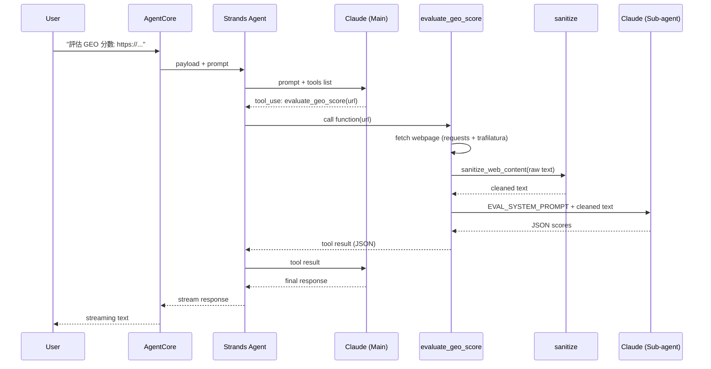
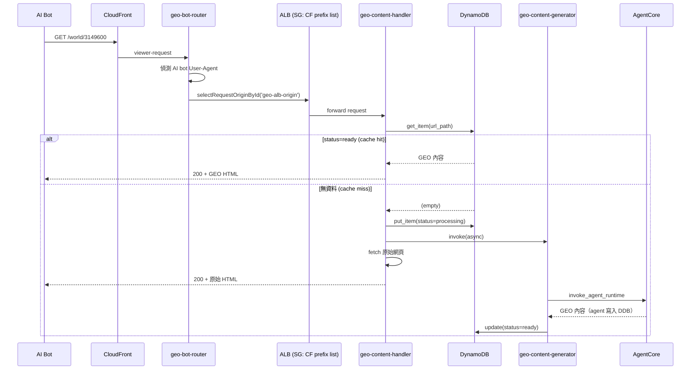
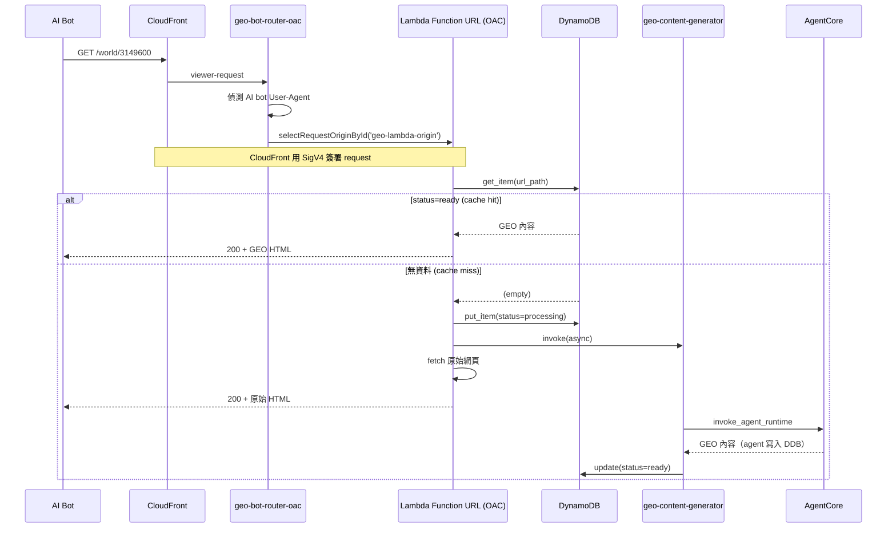
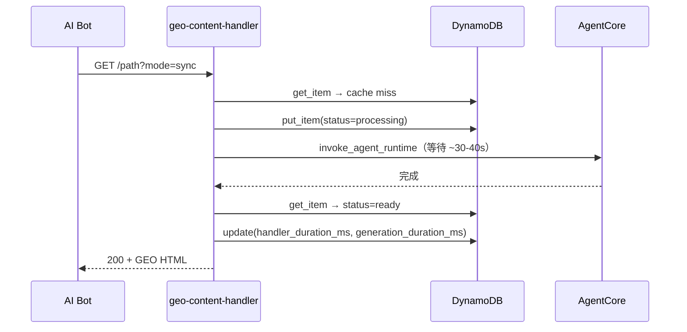

# 架構說明

## 系統總覽

本系統支援兩種 origin 模式，由 SAM template 的 `OriginMode` 參數控制：

### 模式 A：ALB（`OriginMode=alb`）

```
使用者/管理員                        AI Bot (GPTBot, ClaudeBot...)
     │                                      │
     │ agentcore invoke                     │ 訪問網站
     ▼                                      ▼
┌──────────────┐                   ┌──────────────────┐
│ AgentCore    │                   │ CloudFront       │
│ GEO Agent    │                   │ (CDN)            │
│              │                   └────────┬─────────┘
│ 4 Tools:     │                            │
│ - rewrite    │                   ┌────────▼─────────┐
│ - evaluate   │                   │ CFF              │
│ - llms.txt   │                   │ geo-bot-router   │
│ - store_geo  │                   │ 偵測 User-Agent  │
└──────┬───────┘                   └───┬─────────┬────┘
       │                               │         │
       │ lambda:InvokeFunction    AI Bot│    一般使用者
       ▼                               │         ▼
┌──────────────┐                       ▼    原站 Origin
│ geo-content- │              ┌────────────┐  (不變)
│ storage      │              │ ALB        │
│ Lambda       │              │ SG: CF     │
└──────┬───────┘              │ prefix list│
       │ put_item             └─────┬──────┘
       ▼                            │
┌──────────────┐              ┌─────▼──────┐
│ DynamoDB     │◄─────────────│ Lambda     │
│ geo-content  │   get_item   │ handler    │
└──────────────┘              └────────────┘
```

### 模式 B：OAC（`OriginMode=oac`，推薦）

```
使用者/管理員                        AI Bot (GPTBot, ClaudeBot...)
     │                                      │
     │ agentcore invoke                     │ 訪問網站
     ▼                                      ▼
┌──────────────┐                   ┌──────────────────┐
│ AgentCore    │                   │ CloudFront       │
│ GEO Agent    │                   │ (CDN)            │
│              │                   └────────┬─────────┘
│ 4 Tools:     │                            │
│ - rewrite    │                   ┌────────▼─────────┐
│ - evaluate   │                   │ CFF              │
│ - llms.txt   │                   │ geo-bot-router   │
│ - store_geo  │                   │ -oac             │
└──────┬───────┘                   └───┬─────────┬────┘
       │                               │         │
       │ lambda:InvokeFunction    AI Bot│    一般使用者
       ▼                               │         ▼
┌──────────────┐                       ▼    原站 Origin
│ geo-content- │              ┌────────────┐  (不變)
│ storage      │              │ Lambda     │
│ Lambda       │              │ Function   │
└──────┬───────┘              │ URL (OAC)  │
       │ put_item             │ SigV4 認證 │
       ▼                      └─────┬──────┘
┌──────────────┐                    │
│ DynamoDB     │◄───────────────────┘
│ geo-content  │         get_item
└──────────────┘
```

### 模式比較

| | ALB 模式 | OAC 模式 |
|---|---|---|
| Origin | ALB → Lambda | Lambda Function URL |
| 安全機制 | SG (CF prefix list) + `x-origin-verify` | SigV4 (IAM auth) + `x-origin-verify` |
| CFF | `geo-bot-router` → `geo-alb-origin` | `geo-bot-router-oac` → `geo-lambda-origin` |
| 需要 VPC | ✅ | ❌ |
| 額外成本 | ALB + VPC | 零 |
| 推薦 | 已有 VPC 環境 | 新部署、PoC |

## Agent ↔ DynamoDB 解耦架構

Agent 不直接存取 DynamoDB。`store_geo_content` tool 透過 `lambda:InvokeFunction` 呼叫 `geo-content-storage` Lambda，由該 Lambda 負責 DDB 寫入。

```
Agent (store_geo_content)
    │
    │ lambda:InvokeFunction
    ▼
┌──────────────────┐
│ geo-content-     │
│ storage Lambda   │
│ (DDB CRUD)       │
└────────┬─────────┘
         │ put_item
         ▼
┌──────────────────┐
│ DynamoDB         │
│ geo-content      │
└──────────────────┘
```

好處：
- Agent 只需 `lambda:InvokeFunction`，不需 DDB 權限
- DDB schema 變更不影響 Agent 程式碼
- Storage Lambda 可獨立擴展、加 validation、加 logging

## Agent Tool 呼叫流程

以 `evaluate_geo_score` 為例，一次完整的呼叫會經過兩次 Bedrock API call（Main agent 意圖判斷 + Sub-agent 執行），這是延遲的主要來源。



```
User          AgentCore      Strands Agent   Claude (Main)   evaluate_geo_score  sanitize    Claude (Sub)
 │                │                │               │                │               │              │
 │  prompt        │                │               │                │               │              │
 │───────────────>│  payload       │               │                │               │              │
 │                │───────────────>│  prompt+tools  │                │               │              │
 │                │                │──────────────>│                │               │              │
 │                │                │  tool_use     │                │               │              │
 │                │                │<──────────────│                │               │              │
 │                │                │  call(url)    │                │               │              │
 │                │                │──────────────────────────────>│               │              │
 │                │                │               │                │  fetch webpage │              │
 │                │                │               │                │──> requests   │              │
 │                │                │               │                │<── html       │              │
 │                │                │               │                │  sanitize()   │              │
 │                │                │               │                │──────────────>│              │
 │                │                │               │                │  clean text   │              │
 │                │                │               │                │<──────────────│              │
 │                │                │               │                │  prompt+text  │              │
 │                │                │               │                │─────────────────────────────>│
 │                │                │               │                │  JSON scores  │              │
 │                │                │               │                │<─────────────────────────────│
 │                │                │  tool result  │                │               │              │
 │                │                │<──────────────────────────────│               │              │
 │                │                │  tool result  │                │               │              │
 │                │                │──────────────>│                │               │              │
 │                │                │  response     │                │               │              │
 │                │                │<──────────────│                │               │              │
 │                │  stream        │               │                │               │              │
 │                │<───────────────│               │                │               │              │
 │  streaming text│                │               │                │               │              │
 │<───────────────│                │               │                │               │              │
```

## Edge Serving 流程

### ALB 模式 — Passthrough（預設）



### OAC 模式 — Passthrough（預設）



### Sync 模式



## Cache Miss 模式

Lambda 支援三種 cache miss 處理模式，透過 querystring `?mode=` 切換：

| 模式 | querystring | 行為 | 適用場景 |
|------|------------|------|---------|
| passthrough（預設）| 無 或 `?mode=passthrough` | 回原始內容 + 非同步產生 | 正式環境，bot 不會空手而歸 |
| async | `?mode=async` | 回 202 + 非同步產生 | 測試用 |
| sync | `?mode=sync` | 等 AgentCore 產生完才回 | 測試用，需較長 timeout |

## llms.txt 支援

DDB 可存放 `/llms.txt` 內容（`content_type: text/markdown`），AI bot 訪問時由 CFF 偵測並路由到 Lambda，回傳 Markdown 格式的網站索引。

流程：
1. 用 Agent 的 `generate_llms_txt` tool 產出草稿
2. 網站 owner 審核/編輯內容
3. 透過 `geo-content-storage` Lambda 存入 DDB（`url_path: /llms.txt`）
4. AI bot 訪問 `/llms.txt` → CFF 偵測 → Lambda → DDB → 回傳 Markdown

llms.txt 內容由網站 owner 控制，類似 robots.txt 的管理方式。

## DynamoDB Schema

Table: `geo-content`，partition key: `url_path` (S)

| 欄位 | 類型 | 說明 |
|------|------|------|
| `url_path` | S | URL 路徑（partition key） |
| `status` | S | `processing`（產生中）/ `ready`（可服務） |
| `geo_content` | S | GEO 優化後的內容（HTML 或 Markdown） |
| `content_type` | S | `text/html; charset=utf-8` 或 `text/markdown; charset=utf-8` |
| `original_url` | S | 原始完整 URL |
| `mode` | S | 觸發模式：`sync` / `async` |
| `created_at` | S | 記錄建立時間（ISO 8601 UTC） |
| `updated_at` | S | 最後更新時間 |
| `generation_duration_ms` | N | AgentCore 產生 GEO 內容的純時間（ms） |
| `handler_duration_ms` | N | handler Lambda 整體處理時間（sync mode 寫入） |
| `generator_duration_ms` | N | generator Lambda 整體處理時間（async/passthrough mode 寫入） |
| `host` | S | 來源 host（handler 取自 request header，agent 取自 URL netloc，供未來多租戶用） |
| `ttl` | N | DynamoDB TTL（Unix timestamp） |

### 時間欄位說明

- `generation_duration_ms`：純粹 AgentCore invoke 的時間，不含 DDB 讀寫
- `handler_duration_ms`：handler Lambda 從收到 request 到回傳 response 的總時間，只在 sync mode 寫入
- `generator_duration_ms`：generator Lambda 從啟動到完成的總時間，只在 async/passthrough mode 寫入

## Response Headers

Lambda 回傳的 response 會帶以下自訂 header：

| Header | 說明 | 出現時機 |
|--------|------|---------|
| `X-GEO-Optimized: true` | 標記為 GEO 優化內容 | cache hit / sync 產生成功 |
| `X-GEO-Source` | `cache` / `generated` / `passthrough` | 所有 response |
| `X-GEO-Handler-Ms` | handler Lambda 整體處理時間（ms） | 所有 response |
| `X-GEO-Duration-Ms` | AgentCore 產生時間（ms） | cache hit / sync 產生 |
| `X-GEO-Created` | GEO 內容建立時間 | cache hit |

## Origin 保護

### 模式 A：ALB

雙層保護：
1. 網路層：ALB Security Group 只允許 CloudFront managed prefix list（`com.amazonaws.global.cloudfront.origin-facing`）的 IP 存取
2. 應用層（defense-in-depth）：CloudFront origin custom header `x-origin-verify`，Lambda 驗證匹配

### 模式 B：OAC（推薦）

CloudFront OAC + Lambda Function URL（`AuthType: AWS_IAM`）：
1. CloudFront 使用 SigV4 簽署每個 origin request
2. Lambda Function URL 只接受 IAM 認證的請求
3. Lambda permission 限制只有指定的 CloudFront distribution 可以 invoke

兩種模式都額外保留 `x-origin-verify` custom header 作為 defense-in-depth。

## CloudFront Function

兩個 CFF 分別對應兩種 origin 模式：

| CFF | Origin ID | 用途 |
|-----|-----------|------|
| `geo-bot-router` | `geo-alb-origin` | ALB 模式 |
| `geo-bot-router-oac` | `geo-lambda-origin` | OAC 模式 |

偵測邏輯相同：
1. User-Agent 比對：GPTBot、ClaudeBot、PerplexityBot、BingBot 等常見 AI 爬蟲
2. Querystring 模擬：`?ua=genaibot` 用於測試

偵測到後，CFF 會：
- 加上 `x-geo-bot: true`、`x-geo-bot-ua` header
- 透過 `cf.selectRequestOriginById()` 切換到對應的 GEO origin
- `x-origin-verify` header 由 CloudFront origin custom header 自動帶入

## Lambda 函數一覽

| Lambda | 用途 | DDB 權限 | 備註 |
|--------|------|---------|------|
| `geo-content-handler` | 讀取 DDB 回傳 GEO 內容 | CRUD | 支援 ALB 和 Function URL 兩種 event 格式 |
| `geo-content-generator` | 非同步呼叫 AgentCore 產生 GEO 內容 | CRUD | 由 handler 非同步觸發 |
| `geo-content-storage` | 接收 Agent 的寫入請求，存入 DDB | CRUD | Agent 透過 `lambda:InvokeFunction` 呼叫 |
