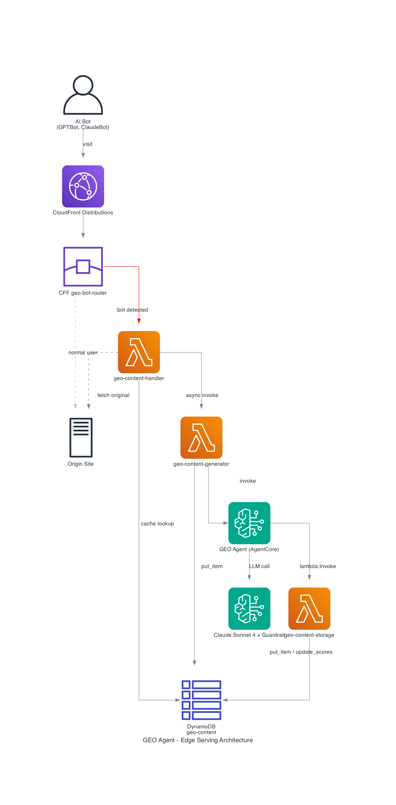
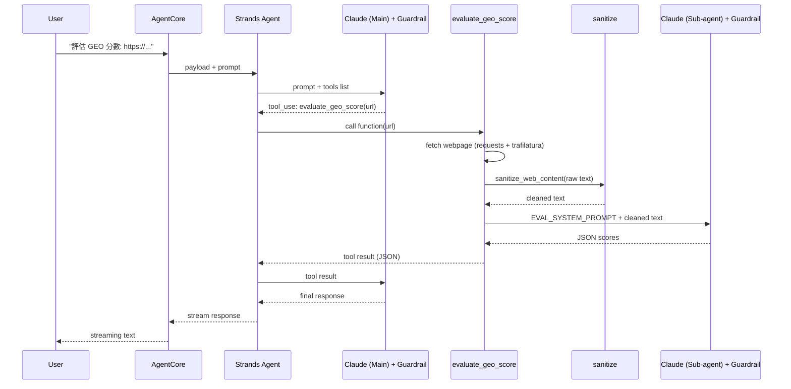
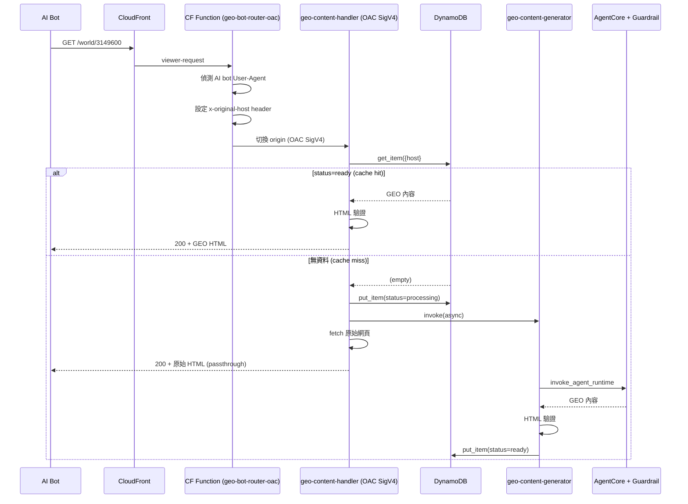
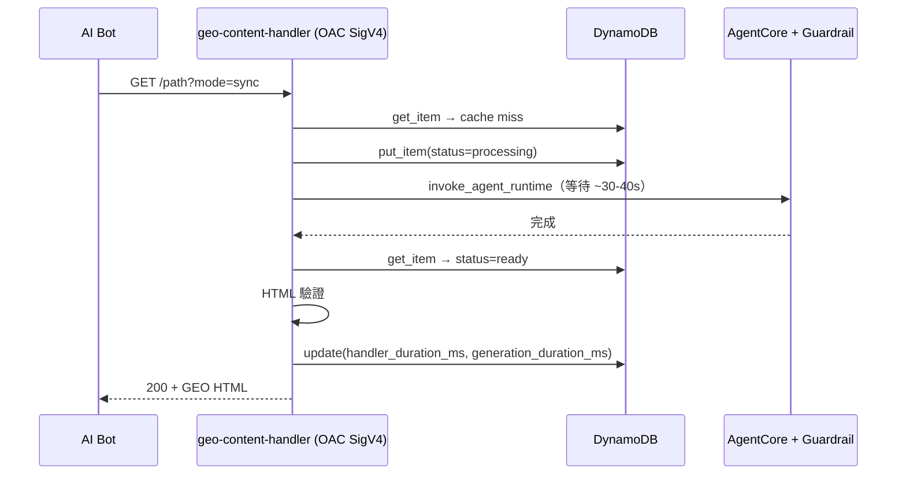

# 架構說明

> [English](architecture.md)

## 系統總覽



本系統使用 CloudFront OAC + Lambda Function URL 架構，零額外成本。
多個 CloudFront distribution 共用同一組 Lambda + DynamoDB，透過 `{host}#{path}` composite key 實現多租戶。

```
AI Bot (GPTBot, ClaudeBot...)
     │
     │ 訪問網站
     ▼
┌──────────────────┐
│ CloudFront       │  ← 多個 distribution 共用同一 Lambda origin
│ (CDN)            │
└────────┬─────────┘
         │
┌────────▼─────────┐
│ CFF              │
│ geo-bot-router   │
│ -oac             │
│ 偵測 User-Agent  │
│ 設定 x-original- │
│ host header      │
└───┬─────────┬────┘
    │         │
AI Bot    一般使用者
    │         ▼
    ▼    原站 Origin (不變)
┌────────────┐
│ Lambda     │
│ Function   │
│ URL (OAC)  │
│ SigV4 認證 │
└─────┬──────┘
      │
      ▼
┌──────────────┐     ┌─────────────────────────┐
│ DynamoDB     │     │ Bedrock AgentCore       │
│ geo-content  │ ◄── │ (GEO Agent)             │
│ {host}#path  │     │   │                     │
└──────────────┘     │   ▼                     │
                     │ Bedrock LLM             │
                     │ + Guardrail（可選）      │
                     └─────────────────────────┘
```

## Agent ↔ DynamoDB 解耦架構

Agent 不直接存取 DynamoDB。`store_geo_content` tool 透過 `lambda:InvokeFunction` 呼叫 `geo-content-storage` Lambda，由該 Lambda 負責 DDB 寫入。

```
Agent (store_geo_content)
    │
    │ lambda:InvokeFunction
    ▼
┌──────────────────┐
│ geo-content-     │
│ storage Lambda   │
│ (DDB CRUD)       │
│ + HTML 驗證      │
└────────┬─────────┘
         │ put_item
         ▼
┌──────────────────┐
│ DynamoDB         │
│ geo-content      │
└──────────────────┘
```

好處：
- Agent 只需 `lambda:InvokeFunction`，不需 DDB 權限
- DDB schema 變更不影響 Agent 程式碼
- Storage Lambda 可獨立擴展、加 validation、加 logging

## Bedrock Guardrail（可選）

系統支援 Bedrock Guardrail，透過環境變數啟用：

| 環境變數 | 預設值 | 說明 |
|---------|--------|------|
| `BEDROCK_GUARDRAIL_ID` | （空，不啟用） | Guardrail ID |
| `BEDROCK_GUARDRAIL_VERSION` | `DRAFT` | Guardrail 版本 |

設定 `BEDROCK_GUARDRAIL_ID` 後，所有透過 `load_model()` 建立的 BedrockModel 都會自動套用 guardrail。
這包含主 agent、rewrite sub-agent、score evaluation sub-agent。
`load_model()` 也支援可選的 `temperature` 參數（例如 `load_model(temperature=0.1)` 用於評分一致性）。

Guardrail 可用於：
- 過濾不當內容（仇恨言論、暴力、色情等）
- 限制 PII 洩漏
- 自訂 denied topics（例如禁止產生特定類型內容）

## Prompt Injection 防護（`sanitize.py`）

由於 agent 會抓取不受信任的網頁內容並餵進 LLM prompt，系統需要防護 indirect prompt injection。`sanitize_web_content()` 在任何抓取的內容送到 LLM 之前執行：

1. 移除 HTML 註解（`<!-- ... -->`）— 攻擊者常把指令藏在這裡
2. 移除不可見 unicode 字元（zero-width、控制字元）— 用來繞過 regex 偵測
3. 替換已知 injection patterns — `ignore all previous instructions`、`[INST]`、`<<SYS>>`、`system:` 等

### Guardrail + Sanitize：互補的防護層

| 防護層 | 防什麼 | 位置 | 範圍 |
|--------|--------|------|------|
| `sanitize.py` | Indirect prompt injection（來自網頁內容） | Tool 層，LLM 看到之前 | 從抓取的文字中移除/替換惡意 pattern |
| Bedrock Guardrail | Content safety（PII、仇恨言論、色情等） | LLM 層，input/output 過濾 | 阻擋不安全的內容生成 |

僅靠 Guardrail 不夠的原因：
- Guardrail 設計目標是 content safety，不是 prompt injection 偵測
- Prompt injection payload（如 "ignore previous instructions"）本身不是不安全內容 — 它是合法的英文句子，Guardrail 不會標記
- 攻擊向量是間接的：惡意指令嵌在網頁中，被 tool 抓取後注入 LLM context
- 當 Guardrail 看到內容時，它已經是 prompt 的一部分 — LLM 可能在 Guardrail 過濾 output 之前就已經遵循了注入的指令

## HTML 內容驗證（三層防護）

為防止 agent 對話文字（如 "Here's your GEO content..."）被誤存為 `geo_content`，系統在三個層級做 HTML 驗證：

| 層級 | 位置 | 驗證邏輯 |
|------|------|---------|
| 1 | `store_geo_content.py`（Agent tool） | Strip 對話前綴，找到第一個 HTML tag 才開始；完全沒 HTML 則不存 |
| 2 | `geo_generator.py`（Generator Lambda） | 從 agent response 提取 HTML 時，regex 匹配 `<article>`、`<section>` 等常見標籤 |
| 3 | `geo_storage.py`（Storage Lambda） | 最後防線：`geo_content` 不以 `<` 開頭直接 reject 400 |

Handler 讀取 cache 時也會驗證：非 HTML 內容會被 purge 並觸發重新生成。

## 多租戶架構

多個 CloudFront distribution 共用同一組 Lambda（`geo-content-handler`、`geo-content-generator`、`geo-content-storage`）和同一張 DynamoDB table。

### 路由流程

1. Bot 訪問 `dq324v08a4yas.cloudfront.net/cars/3141215`
2. CFF 偵測 bot → 設定 `x-original-host: dq324v08a4yas.cloudfront.net` → 路由到 `geo-lambda-origin`
3. Handler 用 `x-original-host` 建立 DDB key：`dq324v08a4yas.cloudfront.net#/cars/3141215`
4. Cache miss → Handler 用 `x-original-host` 作為 fetch URL 的 host（CloudFront default behavior 會 proxy 到正確的 origin site）
5. 觸發 async generator → AgentCore → 存入 DDB

### DDB Key 格式

`{host}#{path}[?query]`

例如：
- `dq324v08a4yas.cloudfront.net#/cars/3141215`
- `dlmwhof468s34.cloudfront.net#/News.aspx?NewsID=1808081`

### 新增站台

1. 建立 CloudFront distribution，default origin 指向原站
2. 加 `geo-lambda-origin` origin，指向 `geo-content-handler` 的 Function URL + OAC
3. 關聯 `geo-bot-router-oac` CFF
4. 在 `geo-content-handler` Lambda 加上該 distribution 的 `InvokeFunctionUrl` permission

## Sequence Diagrams

### Agent Tool 呼叫流程（evaluate_geo_score 為例）

一次完整呼叫經過兩次 Bedrock API call（Main agent 意圖判斷 + Sub-agent 執行）。
若啟用 Guardrail，每次 LLM 呼叫都會經過 Guardrail 過濾。



### Edge Serving — Passthrough 模式（預設）



### Edge Serving — Sync 模式



## Agent Tool 呼叫流程

### store_geo_content — 抓取 + 改寫 + 存儲

```
store_geo_content(url)
    │
    ├── fetch_page_text(url)
    ├── sanitize_web_content(raw_text)
    ├── Rewriter Agent → Bedrock LLM (+Guardrail) → GEO HTML
    │   ├── Strip markdown code blocks
    │   ├── Strip 對話前綴（找第一個 HTML tag）
    │   └── 驗證以 < 開頭
    ├── Storage Lambda → DDB（立即存入，不等評分）
    │
    └── ThreadPoolExecutor（並行評分）
        ├── _evaluate_content_score(original, "original") → Bedrock LLM (+Guardrail)
        └── _evaluate_content_score(geo, "geo-optimized") → Bedrock LLM (+Guardrail)
            └── Storage Lambda → DDB（update_scores action，僅 update_item）
```

### evaluate_geo_score — 三視角評分

| 視角 | URL | User-Agent | 說明 |
|------|-----|-----------|------|
| as-is | 原始輸入 URL | 預設 UA | 無論輸入什麼就抓什麼 |
| original | 去掉 `?ua=genaibot` | 預設 UA | 原始頁面（非 GEO 版本） |
| geo | 去掉 `?ua=genaibot` | GPTBot/1.0 | GEO 優化版本 |

## Edge Serving 流程（Passthrough 模式，預設）

```
Bot → CloudFront → CFF（偵測 bot）→ Lambda Function URL (OAC SigV4)
                                          │
                                    ┌─────▼─────┐
                                    │ DDB lookup │
                                    └─────┬─────┘
                                          │
                              ┌───────────┼───────────┐
                              │           │           │
                         status=ready  processing  no record
                              │           │           │
                         HTML 驗證     stale?      mark processing
                              │        ├─ yes →    trigger async
                         ┌────┴────┐   │  reset    fetch original
                         │ pass  │ │   └─ no →     return original
                         │       │ │     passthrough
                    return GEO  purge &
                    HTML        regenerate
```

## Cache Miss 模式

| 模式 | querystring | 行為 | 適用場景 |
|------|------------|------|---------|
| passthrough（預設）| 無 或 `?mode=passthrough` | 回原始內容 + 非同步產生 | 正式環境 |
| async | `?mode=async` | 回 202 + 非同步產生 | 測試用 |
| sync | `?mode=sync` | 等 AgentCore 產生完才回 | 測試用 |

## DynamoDB Schema

Table: `geo-content`，partition key: `url_path` (S)

| 欄位 | 類型 | 說明 |
|------|------|------|
| `url_path` | S | `{host}#{path}[?query]`（partition key） |
| `status` | S | `processing` / `ready` |
| `geo_content` | S | GEO 優化後的 HTML |
| `content_type` | S | `text/html; charset=utf-8` |
| `original_url` | S | 原始完整 URL |
| `mode` | S | `passthrough` / `async` / `sync` |
| `host` | S | 來源 host |
| `created_at` | S | ISO 8601 UTC |
| `updated_at` | S | 最後更新時間 |
| `generation_duration_ms` | N | AgentCore 產生時間（ms） |
| `generator_duration_ms` | N | Generator Lambda 整體時間（ms） |
| `original_score` | M | 改寫前 GEO 分數（5 維度：authority、freshness、relevance、structure、readability） |
| `geo_score` | M | 改寫後 GEO 分數（同 5 維度） |
| `score_improvement` | N | 分數改善（geo - original） |
| `ttl` | N | DynamoDB TTL（Unix timestamp） |

## Response Headers

| Header | 說明 |
|--------|------|
| `X-GEO-Optimized: true` | GEO 優化內容 |
| `X-GEO-Source` | `cache` / `generated` / `passthrough` |
| `X-GEO-Handler-Ms` | Handler 處理時間（ms） |
| `X-GEO-Duration-Ms` | AgentCore 產生時間（ms） |
| `X-GEO-Created` | 內容建立時間 |

## Origin 保護

CloudFront OAC + Lambda Function URL（`AuthType: AWS_IAM`）：
1. CloudFront 使用 SigV4 簽署每個 origin request
2. Lambda Function URL 只接受 IAM 認證的請求
3. Lambda permission 限制指定的 CloudFront distribution 可以 invoke
4. `x-origin-verify` custom header 作為 defense-in-depth

## Lambda 函數一覽

| Lambda | 用途 | 備註 |
|--------|------|------|
| `geo-content-handler` | 讀取 DDB 回傳 GEO 內容 | Function URL + OAC，多租戶 |
| `geo-content-generator` | 非同步呼叫 AgentCore | 由 handler 觸發 |
| `geo-content-storage` | Agent 寫入 DDB | 含 HTML 驗證，支援 `update_scores` action 僅更新分數欄位 |
