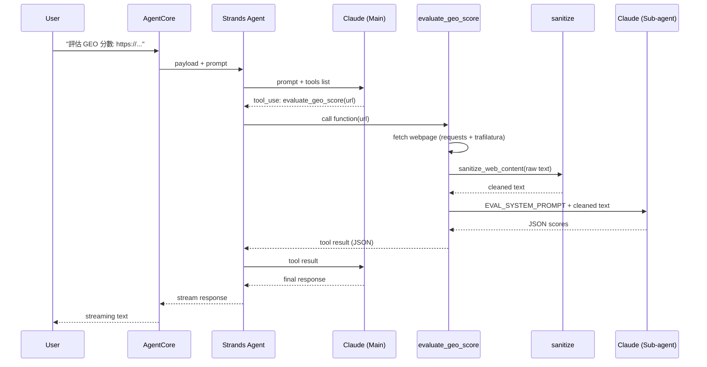

# FAQ

## 為什麼用 Agent，而不是直接寫 Python script 呼叫 Claude？

如果需求是固定的單一任務（例如批次評估一堆 URL 的 GEO 分數），直接寫 script 呼叫 Bedrock API 更快更簡單，只需要一次 Claude 呼叫。

用 Agent framework 的價值在於：

- **意圖判斷**：同一個入口可能要改寫內容、評估分數、或產生 llms.txt，由模型根據使用者的自然語言來決定呼叫哪個 tool
- **多步驟任務**：使用者可以說「先評估這個 URL，然後幫我改寫它的內容」，agent 能串接多個 tool 完成
- **對話式互動**：使用者可以追問、補充要求，agent 維持上下文

代價是多一次 Claude 呼叫來做意圖判斷。如果你的場景不需要這些彈性，直接用 script 是更好的選擇。

## Tool 呼叫流程

以 `evaluate_geo_score` 為例，一次完整的呼叫會經過：

1. 使用者送出 prompt → AgentCore 轉給 Strands Agent
2. Main Agent 把 prompt + tools list 送給 Claude → Claude 決定呼叫 `evaluate_geo_score`
3. Tool 執行：抓取網頁 → sanitize 過濾 → 建立 Sub-agent 請 Claude 評分
4. Tool 結果回傳給 Main Agent 的 Claude → 組織最終回應串流回使用者

整個過程有兩次 Bedrock API call（Main agent 判斷 + Sub-agent 評分），這是延遲的主要來源。

### Mermaid Sequence Diagram



### Text Diagram

```
User          AgentCore      Strands Agent   Claude (Main)   evaluate_geo_score  sanitize    Claude (Sub)
 │                │                │               │                │               │              │
 │  prompt        │                │               │                │               │              │
 │───────────────>│  payload       │               │                │               │              │
 │                │───────────────>│  prompt+tools  │                │               │              │
 │                │                │──────────────>│                │               │              │
 │                │                │  tool_use     │                │               │              │
 │                │                │<──────────────│                │               │              │
 │                │                │  call(url)    │                │               │              │
 │                │                │──────────────────────────────>│               │              │
 │                │                │               │                │  fetch webpage │              │
 │                │                │               │                │──> requests   │              │
 │                │                │               │                │<── html       │              │
 │                │                │               │                │  sanitize()   │              │
 │                │                │               │                │──────────────>│              │
 │                │                │               │                │  clean text   │              │
 │                │                │               │                │<──────────────│              │
 │                │                │               │                │  prompt+text  │              │
 │                │                │               │                │─────────────────────────────>│
 │                │                │               │                │  JSON scores  │              │
 │                │                │               │                │<─────────────────────────────│
 │                │                │  tool result  │                │               │              │
 │                │                │<──────────────────────────────│               │              │
 │                │                │  tool result  │                │               │              │
 │                │                │──────────────>│                │               │              │
 │                │                │  response     │                │               │              │
 │                │                │<──────────────│                │               │              │
 │                │  stream        │               │                │               │              │
 │                │<───────────────│               │                │               │              │
 │  streaming text│                │               │                │               │              │
 │<───────────────│                │               │                │               │              │
```

## Strands `@tool` vs MCP

這個專案的 tool 用 Strands 的 `@tool` decorator 定義，跟 agent 跑在同一個 process，呼叫就是 Python function call，沒有額外的網路開銷。

MCP (Model Context Protocol) 是標準化的 client/server 協議，tool 跑在獨立的 server 上，每次呼叫有 I/O 開銷，但好處是任何 MCP client 都能接。對這個專案來說，tool 不需要被其他 client 共用，用 `@tool` 更直接。
